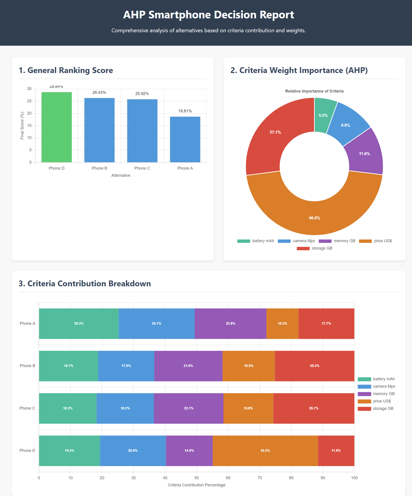

# AHPd — Data-Driven Multi-Criteria Decision System


**AHPd** is a **100% objective, multi-criteria decision-making system**, representing a **modern, data-driven evolution** of the classic *Analytic Hierarchy Process (AHP)* method.

Unlike traditional AHP, AHPd eliminates subjective judgment. It uses **real, measurable data** to generate business decisions that are consistently **auditable, mathematical, and justifiable**.

## 🎯 Strategic Advantage: Bias-Free Decisions

In complex and highly regulated environments, **subjectivity** is the biggest risk. AHPd was built to eliminate this risk.

The AHPd system provides a quantitative framework for comparing alternatives—be it products, projects, suppliers, or strategies—based on their quantitative attributes (price, performance, quality, resource consumption, etc.).

| Key Benefit | Value for Decision Makers |
| :--- | :--- |
| **100% Objective Decisions** | Criteria weights are mathematically derived from **real-world data**, removing human bias and politics from complex choices. **Risk Mitigation** and guaranteed *compliance*. |
| **Full Explainability** | Every result is detailed with the **percentage contribution** of each criterion and attribute. Allows for **Investment Justification** and instant result auditing. |
| **High Consistency & Reproducibility** | No manual subjectivity. The same data always yields the same, fully **justifiable**, and **unquestionable** result. |
| **High Performance (C/Rust Core)** | Implemented with a highly optimized C/Rust core to process large volumes of data quickly. **Accelerates Time-to-Decision** in real-time systems. |

## 🧠 How AHPd Works: Simple Process, Auditable Result

AHPd automatically transforms raw data into strategic insights **without the need for data pre-processing or normalization**.

1.  **Define Preferences (Minimum Input):** Specify the criteria and indicate whether you want to **maximize** or **minimize** each one (e.g., "Maximize Quality," "Minimize Price").
2.  **Provide Raw Data:** Input the quantitative data for all options being compared. **Data can be passed exactly as it exists in your system.**
3.  **AHPd Automatic Calculation:**
      * The system analyzes the **statistical spread** of values across all options.
      * **Automatically assigns the weight of importance** to each criterion based on this spread.
      * Determines the **relative performance (priority)** of each alternative.
4.  **Final Ranking:** The output is a **clear, auditable percentage ranking**, showing **which alternative is best and why**.

### 📊 Intuitive Example

Consider a device purchase decision. The user only needs to indicate whether a lower "price" is better or a larger "battery" is better.

| Option | Price US$ (Minimize) | Storage GB (Maximize) | Memory GB (Maximize) | Camera Mpx (Maximize) | Battery mAh (Maximize) |
| :--- | :--- | :--- | :--- | :--- | :--- |
| **Phone A** | 9494 | 128 | 6 | 48 | 4323 |
| **Phone B** | 4139 | 256 | 8 | 50 | 4500 |
| **Phone C** | 4429 | 256 | 8 | 50 | 4300 |
| **Phone D** | 1885 | 128 | 6 | 64 | 5065 |

**➡️ AHPd Ranking Result:**

  * **Phone D** — **33.6%** (Winner)
  * **Phone B** — 25.38%
  * **Phone C** — 26.1%
  * **Phone A** — 14.93%

The screenshot below intuitively shows the results, allowing you to see **precisely how much each feature (criterion)** contributed to the final ranking score. **This visually validates the weights calculated by AHPd**.



> 💡 **Explanation:** **Phone D** (33.6% final score) won because it was the **lowest-priced alternative**. AHPd calculated that the **'price US\$'** criterion had the **greatest statistical disparity** among all candidates, assigning it a massive weight of **46.0%** in the decision model. This resulted in Price having a **33.3% contribution** to Phone D's total score, outweighing the contribution of any other single criterion for all other alternatives.

**Verbose results:**

```json
{
  "contribution": {
    "alternatives_contribution": {
      "by_criteria": {
        "Phone A": {
          "battery mAh": 25.27140468399798,
          "camera Mpx": 24.073235745226988,
          "memory GB": 22.7835981160184,
          "price US$": 10.151185142297878,
          "storage GB": 17.720576312458753
        },
        "Phone B": {
          "battery mAh": 18.725026772638852,
          "camera Mpx": 17.849621957062656,
          "memory GB": 21.623542027984474,
          "price US$": 16.57434354299879,
          "storage GB": 25.227465699315214
        },
        "Phone C": {
          "battery mAh": 18.24259984226682,
          "camera Mpx": 18.198574261252137,
          "memory GB": 22.046272819345443,
          "price US$": 15.791901454565918,
          "storage GB": 25.720651622569683
        },
        "Phone D": {
          "battery mAh": 19.309583049401244,
          "camera Mpx": 20.932567729107106,
          "memory GB": 14.85838512914299,
          "price US$": 33.34294232523744,
          "storage GB": 11.556521767111215
        }
      },
      "total_percentage": {
        "Phone A": 18.810524412740325,
        "Phone B": 26.42622428319317,
        "Phone C": 25.91950921187671,
        "Phone D": 28.843742092189796
      }
    },
    "criteria_weights": {
      "battery mAh": 0.05517554629857757,
      "camera Mpx": 0.09811746760930982,
      "memory GB": 0.11601983189243667,
      "price US$": 0.4599742131173236,
      "storage GB": 0.27071294108235233
    }
  },
  "rank": {
    "Phone A": 0.14922568130663832,
    "Phone B": 0.260912125126531,
    "Phone C": 0.25370960371891654,
    "Phone D": 0.336152589847914
  }
}
```

### Detailed Analysis

AHPd assigned the following weights of importance to the criteria, highlighting the focus on Price:

| Criterion | AHPd Importance Weight | Interpretation |
| :--- | :--- | :--- |
| **price US\$** (Minimize) | **45.99%** | The largest variation among phones. This is the single decisive factor. |
| **storage GB** (Maximize) | **27.07%** | Second-largest data spread among the phones. |
| **memory GB** (Maximize) | **11.60%** | Relatively low variation among phones. |
| **camera Mpx** (Maximize) | **9.81%** | Medium variation among the data. |
| **battery mAh** (Maximize) | **5.52%** | The smallest data spread. This criterion barely influenced the decision. |

**Conclusion:** AHPd objectively determined that the **vast price difference** among the candidates was the most relevant attribute for the final decision, given the distribution of the input data.

> *(The image visually demonstrates the percentage contribution of each criterion to the final ranking score, **validating the weights calculated by AHPd**.)*

## 🧾 Practical Use Cases (Where AHPd Generates Value)

| Area | Typical Application | Strategic Outcome |
| :--- | :--- | :--- |
| **IT & Engineering** | Selecting *cloud* architectures, choosing software/hardware vendors, prioritizing *sprints*. | **Reduced Deployment Costs** and increased system efficiency based on real performance data. |
| **Finance** | Comparing investments based on return, risk, liquidity, and sustainability. | Automated **Portfolio Optimization** and risk alignment. |
| **Operations & HR** | Choosing equipment, route optimization, or evaluating candidates/suppliers. | **Measurable Consistency** in selection processes and reduced operational *overhead*. |
| **Product & Marketing** | Prioritizing features in *roadmaps* or comparative analysis of competitor products. | **Data-Driven Roadmaps** and clear competitive advantage. |

## 🚀 Integration and Performance

AHPd is designed to be platform-agnostic and offer maximum performance, allowing the **integration of real-time decision intelligence** into your critical systems (BI, ERPs, recommendation systems).

| Type | Description | Link |
| :--- | :--- | :--- |
| **PHP Native Extension** | Native C/Rust implementation for **maximum performance** within PHP systems. | 🔗 [View PHP Documentation](./php-extension/README.md) |
| **REST API** | JSON-compatible web service for immediate integration with **any** programming language or BI tool. | 🔗 [Online Service](https://ahpbi.wead.tech/api-rest) |
| **CLI Application** | Command-line tool for direct use in automated pipelines and scripts. | 🔗 [AHPd CLI](https://github.com/weadtech/ahpd_cli_public) |
| **GUI Application** | Desktop application for end-user analysis and reporting. | *(Planned)* |

## 📚 AHPd vs. Traditional AHP: The Data-Driven Evolution

This comparison highlights the key differences that make AHPd the ideal choice for automated and auditable systems, in contrast to the manual approach of classical AHP.

| Feature | AHPd (Data-Driven Evolution) | Traditional AHP (Classic Method) |
| :--- | :--- | :--- |
| **Input Source** | **Real, Quantitative Data** (e.g., price, speed, capacity). | **Subjective Judgments** (Expert opinions, verbal comparisons). |
| **Criterion Weighting** | **Automatic.** Mathematically derived from the data's statistical dispersion. | **Manual.** Derived from subjective **pairwise comparisons** of importance. |
| **Objectivity** | **Fully Objective.** Consistent, unquestionable, and reproducible results. | **Subjective/Semi-Objective.** Depends on the consistency and bias of human judges. |
| **Primary Goal** | Multi-criteria **Optimization** and **Auditable Ranking** based on performance. | Multi-criteria **Prioritization** based on perceived importance. |

## 🧬 Licensing and Intellectual Property

The **use** and **distribution** of the AHPd system are **free** for both personal and commercial purposes. Compiled binaries, extensions, and libraries may be integrated into third-party products or services without additional licensing fees.

However, the high-performance computational core and underlying source code remain the **exclusive intellectual property of Wead Technology®**, ensuring integrity and continuous innovation.

### Required Attribution

The use of AHPd requires **mandatory attribution** to Wead Technology® in your documentation, "About" section, or any licensing notices related to the product that integrates it.

### Enterprise Services

Enterprise-grade services — including **dedicated technical support**, **OEM integration**, **private cloud APIs**, and **performance optimization** — are available for organizations seeking maximum scalability, reliability, and expert assistance.

For partnerships, large-scale deployments, or OEM licensing, contact Wead Technology® to discuss collaboration opportunities.
