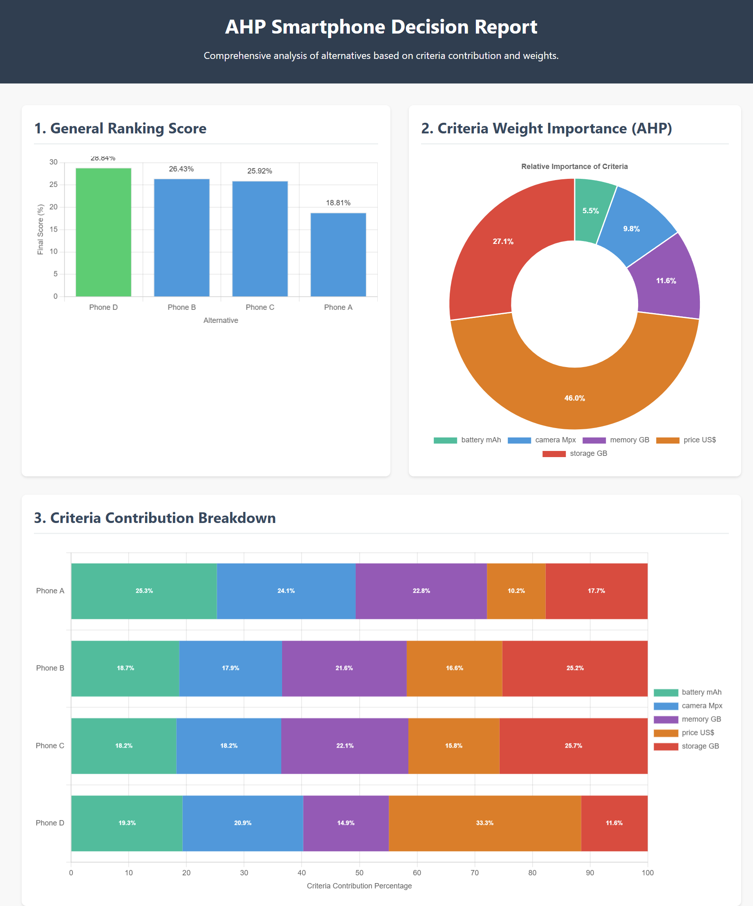

# PHP AHPd (AHP Data-Driven) Extension

AHPd is a high-performance C/Rust extension for PHP that delivers a modern, data-driven implementation of the Analytic Hierarchy Process (AHP) — replacing subjective pairwise judgments with real-world quantitative data for objective, multi-criteria decision-making.

## Key Features & Compatibility

| Feature | Details |
| :--- | :--- |
| **PHP Support** | **PHP 8.1 or superior** is required (including PHP 8.2, 8.3, and future versions). |
| **Thread Safety** | Supports both **Thread-Safe (TS)** and **Non-Thread-Safe (NTS)** builds. |
| **Language** | Core logic is implemented in **high-performance C/Rust**. |


## Installation

AHPd is a powerful PHP extension and must be installed using one of the following methods.

### 1 Installation via PIE (PHP Extension Installer) (Preferred Method)

The recommended and simplest way to install AHPd is by using the **PIE** tool. PIE streamlines the deployment and configuration process by automatically handling pre-compiled files:

```bash
# Assuming you have PIE installed (https://github.com/php/pie)
pie install wead/ahpd
```

PIE will handle **downloading the pre-compiled binaries**, **unpacking** the extension for your specific PHP version (TS or NTS), and **configuring your `php.ini`**.

### 2 Manual Installation

For custom environments or specific architectures, you can install the extension manually by working directly with the binaries:

1.  **Download the Binary:** Download the pre-compiled extension file (e.g., `ahpd.so` or `ahpd.dll`) corresponding to your operating system and PHP version from the [official GitHub repository](https://github.com/weadtech/ahpd_lib).
2.  **Place the File:** Place the downloaded binary file into your PHP's extensions directory (usually specified by `extension_dir` in `php.ini`).

### Enabling the Extension in `php.ini`

Regardless of the installation method, you must add the following line to your PHP configuration file (`php.ini`):

```ini
extension=ahpd.so
```

*(Note: The file extension may vary depending on your operating system, e.g., `ahpd.dll` on Windows.)*

## About

We are proud to release the **AHPd library for PHP**, heavily inspired by the famous decision-making algorithm invented by Thomas L. Saaty.

AHPd is entirely data-driven; subjectivity becomes null depending on how it is used.

As already described in [the main documentation](./README.md), AHPd is based on the user's preferences when defining the criteria, whether to **"maximize"** or **"minimize"** each criterion. This is the _"subjective"_ part of AHPd, as it is up to the user to define whether the ideal is **"max"** or **"min."**

The data receives only a label, which names the option, and its values ​​for each criterion.

The subjectivity here is less explicit; the discrete values ​​can be anything, for example:

| Option  | price US$ (min) | storage GB (max) | memory GB (max) | camera Mpx (max) | battery mAh (max) |
|----------|-----------------|------------------|------------------|------------------|-------------------|
| Phone A  | 9494            | 128              | 6                | 48               | 4323              |
| Phone B  | 4139            | 256              | 8                | 50               | 4500              |
| Phone C  | 4429            | 256              | 8                | 50               | 4300              |
| Phone D  | 1885            | 128              | 6                | 64               | 5065              |

Note that the data was passed **without** any transformation, **without** normalization, **exactly as it is in the real world**.

The user only needed to indicate whether a lower "price" is better or a larger "battery" is better.

Subjective data could also be passed, for example, "What is the rating of this product in an online store?" or "What is the rating in terms of design?" **The only requirement** is that the values ​​be numerical.

## PHP Usage

The implementation in PHP is extremely simple, note:

```php
<?php

use \AHPd\Data;

$ahp = new Data;

// 1. Define the preferences (Min/Max) for ALL used criteria.
$ahp->setCriteria([
    'price US$'     => 'min', // Price: we want the MINIMUM (lower is better)
    'storage GB'    => 'max', // Storage: we want the MAXIMUM (higher is better)
    'memory GB'     => 'max', // Memory: we want the MAXIMUM
    'camera Mpx'    => 'max', // Camera: we want the MAXIMUM
    'battery mAh'   => 'max', // Battery: we want the MAXIMUM
]);

$ahp->setOption(
    'Phone A',
    [
        'price US$'     => 9494,
        'storage GB'    => 128,
        'memory GB'     => 6,
        'camera Mpx'    => 48,
        'battery mAh'   => 4323,
    ]
);

// Option: Phone B
$ahp->setOption(
    'Phone B',
    [
        'price US$'     => 4139,
        'storage GB'    => 256,
        'memory GB'     => 8,
        'camera Mpx'    => 50,
        'battery mAh'   => 4500,
    ]
);

// Option: Phone C
$ahp->setOption(
    'Phone C',
    [
        'price US$'     => 4429,
        'storage GB'    => 256,
        'memory GB'     => 8,
        'camera Mpx'    => 50,
        'battery mAh'   => 4300,
    ]
);

// Option: Phone D
$ahp->setOption(
    'Phone D',
    [
        'price US$'     => 1885,
        'storage GB'    => 128,
        'memory GB'     => 6,
        'camera Mpx'    => 64,
        'battery mAh'   => 5065,
    ]
);

// simple rank
print_r($ahp->run(rank: true, contribution_global: false, contribution_detailed: false));

// fully detailed (default true for all arguments)
print_r($ahp->run());

print_r($ahp->listOptions());

print_r($ahp->getOption('Phone C'));

print_r($ahp->getCriteria('price US$'));

print_r($ahp->listCriteria());
```

**Raw Output**
```txt
Array
(
    [rank] => Array
        (
            [Phone A] => 0.14922568130664
            [Phone B] => 0.26091212512653
            [Phone C] => 0.25370960371892
            [Phone D] => 0.33615258984791
        )

)
Array
(
    [contribution] => Array
        (
            [alternatives_contribution] => Array
                (
                    [by_criteria] => Array
                        (
                            [Phone A] => Array
                                (
                                    [battery mAh] => 25.271404683998
                                    [camera Mpx] => 24.073235745227
                                    [memory GB] => 22.783598116018
                                    [price US$] => 10.151185142298
                                    [storage GB] => 17.720576312459
                                )

                            [Phone B] => Array
                                (
                                    [battery mAh] => 18.725026772639
                                    [camera Mpx] => 17.849621957063
                                    [memory GB] => 21.623542027984
                                    [price US$] => 16.574343542999
                                    [storage GB] => 25.227465699315
                                )

                            [Phone C] => Array
                                (
                                    [battery mAh] => 18.242599842267
                                    [camera Mpx] => 18.198574261252
                                    [memory GB] => 22.046272819345
                                    [price US$] => 15.791901454566
                                    [storage GB] => 25.72065162257
                                )

                            [Phone D] => Array
                                (
                                    [battery mAh] => 19.309583049401
                                    [camera Mpx] => 20.932567729107
                                    [memory GB] => 14.858385129143
                                    [price US$] => 33.342942325237
                                    [storage GB] => 11.556521767111
                                )

                        )

                    [total_percentage] => Array
                        (
                            [Phone A] => 18.81052441274
                            [Phone B] => 26.426224283193
                            [Phone C] => 25.919509211877
                            [Phone D] => 28.84374209219
                        )

                )

            [criteria_weights] => Array
                (
                    [battery mAh] => 0.055175546298578
                    [camera Mpx] => 0.09811746760931
                    [memory GB] => 0.11601983189244
                    [price US$] => 0.45997421311732
                    [storage GB] => 0.27071294108235
                )

        )

    [rank] => Array
        (
            [Phone A] => 0.14922568130664
            [Phone B] => 0.26091212512653
            [Phone C] => 0.25370960371892
            [Phone D] => 0.33615258984791
        )

)
Array
(
    [0] => Phone A
    [1] => Phone B
    [2] => Phone C
    [3] => Phone D
)
Array
(
    [battery mAh] => 4300
    [camera Mpx] => 50
    [memory GB] => 8
    [price US$] => 4429
    [storage GB] => 256
)
minArray
(
    [battery mAh] => max
    [camera Mpx] => max
    [memory GB] => max
    [price US$] => min
    [storage GB] => max
)
```

### Example visual (with Chart.js)

The screenshot below intuitively shows the results of the analysis and how each criterion influenced the final decision.

The screenshot below intuitively shows the results, allowing you to see **precisely how much each feature (criterion)** contributed to the final ranking score. **This visually validates the weights calculated by AHPd**.



### 1 Final Rank: Overall Priority

This array shows the overall priority weight for each alternative (phone), calculated by the AHP method. The sum of the weights equals 1.0 (or 100%).

| Option | Priority Weight (Raw) | Priority Weight (%) | Rank |
| :--- | :--- | :--- | :--- |
| **Phone D** | $0.33615259$ | **33.62%** | **1st** |
| **Phone B** | $0.26091213$ | **26.09%** | **2nd** |
| **Phone C** | $0.25370960$ | **25.37%** | **3rd** |
| **Phone A** | $0.14922568$ | **14.92%** | **4th** |

**Conclusion:** **Phone D** is the most preferred option, contributing $\mathbf{33.62\%}$ of the total preference, primarily due to its combination of good features and the lowest price.

## 2 Contribution Details: Understanding the *Why*

This section doesn't just show the final outcome; it provides an **audit trail** of the decision, detailing how much influence each criterion and each alternative's performance had on the final score. It answers two critical questions:

1.  **How important was each criterion?** (The weight of Price vs. Storage, etc.)
2.  **How did each phone's specific attributes contribute to its final rank?** (The impact of a low price or high memory.)

### 2.1 Criteria Weights: The Global Importance

The **Criteria Weights** represent the **global importance** of each criterion in the decision model. Since you did not manually provide pairwise comparisons (the traditional AHP step), the AHPd library derives these weights by analyzing the **dispersion and performance of the alternatives** across your defined Min/Max preferences.

* **How they're calculated:** Criteria where the alternatives show the largest relative differences, and thus exhibit a clearer "winner" or "loser" based on the set preference (Min/Max), generally receive a higher derived weight.
* **Example: Price vs. Battery:** In your case, the **Price US\$** criterion received a $\mathbf{46.00\%}$ weight. This is because the price range (from $\$1885$ to $\$9494$) is so wide that it creates a huge performance disparity between the phones, making price the dominant factor. In contrast, the **Battery mAh** weight is only $5.52\%$ because the relative difference in battery capacities across all phones is much smaller, reducing its overall influence on the final rank.

| Criterion | Importance (%) | Derived from... |
| :--- | :--- | :--- |
| **Price US\$** | $\mathbf{46.00\%}$ | Large performance difference due to the wide price spread. |
| **Battery mAh** | $5.52\%$ | Small performance difference due to closer battery values. |

### 2.2 Alternative Contribution: The Local Impact

The **Alternative Contribution** is the detailed breakdown showing the **local impact** of a specific attribute value (e.g., Phone D's price of $\$1885$) on that phone's total score. It's essentially the product of two factors:

$$\text{Contribution} = \text{Local Priority Score} \times \text{Global Criterion Weight}$$

#### Contribution by Criteria (Detailed)

This shows, for each phone, the percentage that each individual criterion contributes to the phone's **overall priority score**.

* **Example: Phone D's Price (33.34%):** Phone D had the lowest price ($\$1885$), which earned it a high local priority score on the "price" criterion. When this high local score is multiplied by the extremely high global weight of price ($\approx 46\%$), it results in a massive $\mathbf{33.34\%}$ contribution to Phone D's final rank. This explains *precisely* why Phone D is the winner.

* **Example: Phone B's Storage (25.23%):** Phone B had a high storage capacity ($256$ GB) which earned it a high local priority score. Since the **Storage GB** criterion itself had a high global weight ($\approx 27\%$), this attribute became the largest contributor to Phone B's score.

#### Total Percentage Contribution

This is the final aggregation: the sum of all the individual contributions for a given phone, presented as a percentage. It provides a simple, direct number that confirms the ranking order established in Section 1, derived from the detailed breakdown.

#### 2.3 Criteria Weights Summary: Importance of Each Factor

This array shows the calculated weight (importance) of each criterion in the overall decision model. These weights reflect how much each attribute (e.g., Price, Storage) influences the final rank. The sum of weights is 1.0 (or 100%).

| Criterion | Weight (Raw) | Importance (%) | Preference |
| :--- | :--- | :--- | :--- |
| **price US$** | $0.45997421$ | $\mathbf{46.00\%}$ | **Min** (Lower is Better) |
| **storage GB** | $0.27071294$ | $27.07\%$ | Max (Higher is Better) |
| **memory GB** | $0.11601983$ | $11.60\%$ | Max (Higher is Better) |
| **camera Mpx** | $0.09811747$ | $9.81\%$ | Max (Higher is Better) |
| **battery mAh** | $0.05517555$ | $5.52\%$ | Max (Higher is Better) |

**Insight:** **Price** is, by far, the most critical factor in this analysis ($\mathbf{46\%}$ of the decision), followed by **Storage** ($27.07\%$).

#### 2.2 Alternative Contribution: Detailed Breakdown

This section shows the performance of each phone, detailed by how much each criterion contributed to that phone's total score.

#### Contribution by Criteria (`by_criteria` in Percentages)

This table shows, for each phone, the percentage contribution of its attribute values towards its own total score.

| Option | Criterion | Contribution (%) | Key Attribute Value |
| :--- | :--- | :--- | :--- |
| **Phone A** | battery mAh | $25.27\%$ | $4323$ mAh |
| | camera Mpx | $24.07\%$ | $48$ Mpx |
| | memory GB | $22.78\%$ | $6$ GB |
| | storage GB | $17.72\%$ | $128$ GB |
| | price US$ | $10.15\%$ | $9494$ |
| **Phone B** | storage GB | $25.23\%$ | $256$ GB |
| | memory GB | $21.62\%$ | $8$ GB |
| | camera Mpx | $17.85\%$ | $50$ Mpx |
| | battery mAh | $18.73\%$ | $4500$ mAh |
| | price US$ | $16.57\%$ | $4139$ |
| **Phone C** | storage GB | $25.72\%$ | $256$ GB |
| | memory GB | $22.05\%$ | $8$ GB |
| | camera Mpx | $18.20\%$ | $50$ Mpx |
| | battery mAh | $18.24\%$ | $4300$ mAh |
| | price US$ | $15.79\%$ | $4429$ |
| **Phone D** | **price US$** | $\mathbf{33.34\%}$ | $\mathbf{1885}$ |
| | camera Mpx | $20.93\%$ | $64$ Mpx |
| | battery mAh | $19.31\%$ | $5065$ mAh |
| | memory GB | $14.86\%$ | $6$ GB |
| | storage GB | $11.56\%$ | $128$ GB |

**Key Insight:** For **Phone D**, the $\mathbf{33.34\%}$ contribution from its price is the single biggest factor pushing it to the top rank. For Phones B and C, their **Storage** performance ($256$ GB) is their top contributor.

#### Total Percentage Contribution

This is the sum of the percentage contributions of all criteria for each phone, essentially a percentage view of the performance score.

| Option | Total Percentage Contribution |
| :--- | :--- |
| **Phone D** | $\mathbf{28.84\%}$ |
| Phone B | $26.43\%$ |
| Phone C | $25.92\%$ |
| Phone A | $18.81\%$ |

### 3 Utility Functions and Inputs

These arrays confirm the list of alternatives and the criteria settings used.

#### 3.1 Options List

```php
Array
(
    [0] => Phone A
    [1] => Phone B
    [2] => Phone C
    [3] => Phone D
)
```

#### 3.2 Phone C Data (`getOption('Phone C')`)

```php
Array
(
    [battery mAh] => 4300
    [camera Mpx] => 50
    [memory GB] => 8
    [price US$] => 4429
    [storage GB] => 256
)
```

#### 3.2 Criteria Preferences (`getCriteria('price US$')` & `listCriteria()`)

The price preference is explicitly set to **'min'**.

```
min
```

The full list of criteria preferences:

```php
Array
(
    [battery mAh] => max
    [camera Mpx] => max
    [memory GB] => max
    [price US$] => min
    [storage GB] => max
)
```

